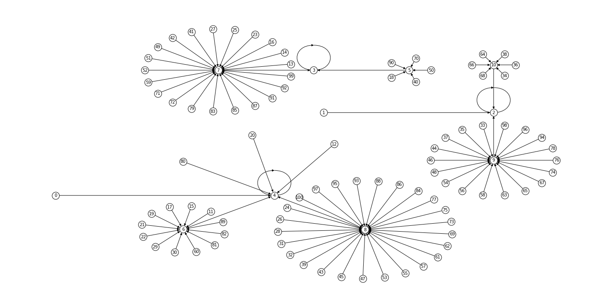

# word-chains
The notebook generates a visualisation of a graph for the following sequence for different languages:

1. You start with any number you want
2. You count the number of letters in the word representing this number. This is the next number in your sequence.

The result looks like this:

MEdium article about it: https://vityazevdanil.medium.com/how-many-numbers-have-the-same-number-of-letters-in-their-name-as-their-value-b9387d906b13
